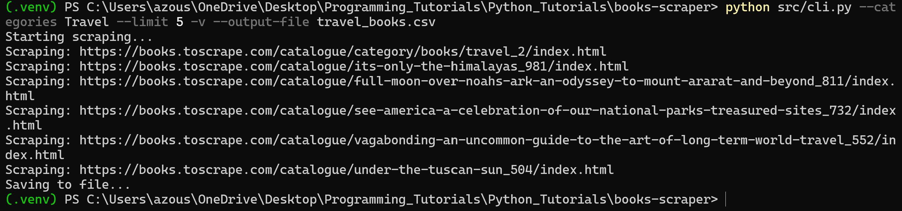
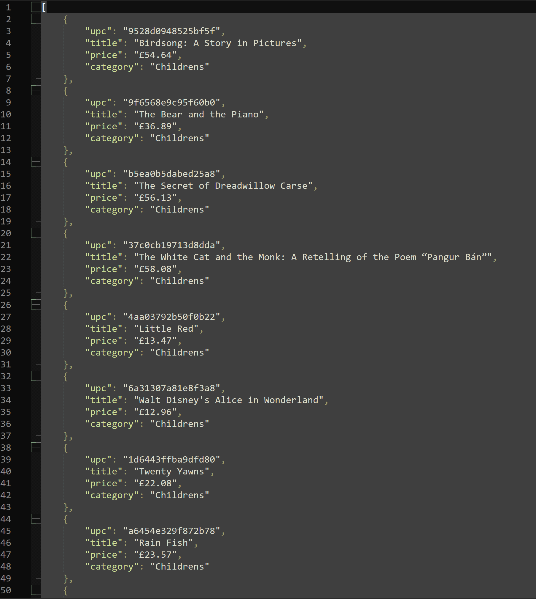

# Books Scraper

A command-line web scraper built with Python that extracts detailed book information from Books to Scrape.

The scraper supports category filtering, configurable scrape limits, CSV/JSON export, retry handling, and verbose logging.

---

## Features

- Scrapes detailed book information from Books to Scrape
- Supports category-based scraping
- Configurable scrape limits
- CSV and JSON export support
- Retry and timeout handling
- Request throttling with delays
- Verbose logging mode
- Modular scraper architecture

---

## Technologies Used

- Python
- requests
- BeautifulSoup4
- pandas
- argparse
- urllib3

---

## Project Structure

```text
books-scraper/
│
├── src/
│   ├── cli.py
│   ├── scraper.py
│   ├── parser.py
│   └── exporter.py
│
├── outputs/
│   ├── sample_books.csv
│   └── sample_books.json
│
├── requirements.txt
├── README.md
└── .gitignore
```

---

## Installation

Clone the repository:

```bash
git clone https://github.com/wedjasouza/books-scraper.git
cd books-scraper
```

Install dependencies:

```bash
pip install -r requirements.txt
```

---

## Usage

### Scrape all books

```bash
python src/cli.py --output-file outputs/books.csv
```

### Scrape specific categories

```bash
python src/cli.py \
    --categories Travel Mystery \
    --output-file outputs/books.csv
```

### Limit the number of books scraped

```bash
python src/cli.py \
    --categories Travel \
    --limit 10 \
    --output-file outputs/books.csv
```

### Export as JSON

```bash
python src/cli.py \
    --categories Mystery \
    --format json \
    --output-file outputs/books.json
```

### Enable verbose mode

```bash
python src/cli.py \
    --verbose \
    --output-file outputs/books.csv
```

---

## Example CLI Usage



## Output Data

The scraper extracts:

- Title
- UPC
- Price
- Category

Example CSV and JSON outputs are included in the `outputs/` directory.

---

## Sample Output



## Reliability Features

The scraper includes:

- configurable request timeouts
- automatic retry handling
- polite request delays
- category validation
- error handling for failed requests

---

## Future Improvements

Potential future enhancements include:

- asynchronous scraping
- SQLite/PostgreSQL support
- Docker containerization
- Playwright integration for JavaScript-heavy sites
- additional export formats

---

## Disclaimer

This project was created for educational and portfolio purposes using the public practice website:

https://books.toscrape.com/

## Author

Wedja Souza  
GitHub: https://github.com/wedjasouza
LinkedIn: https://linkedin.com/in/wedja-souza